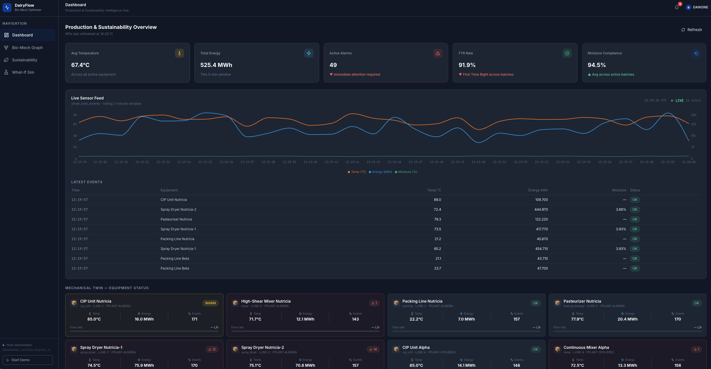
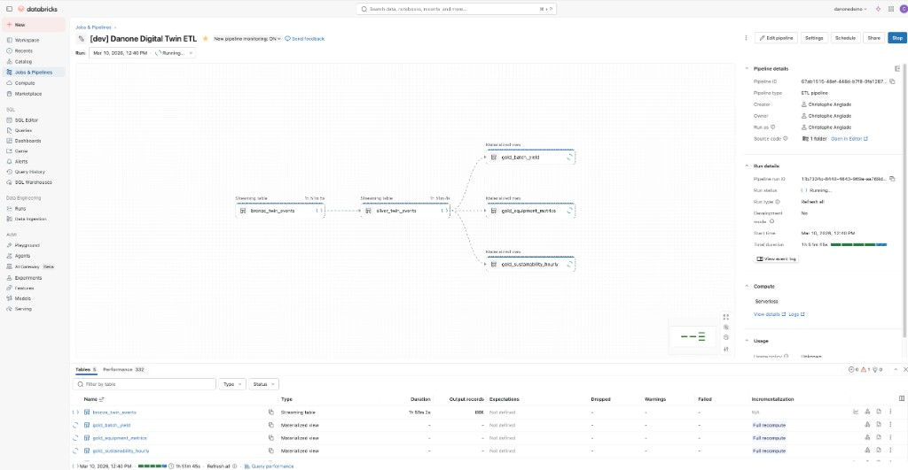
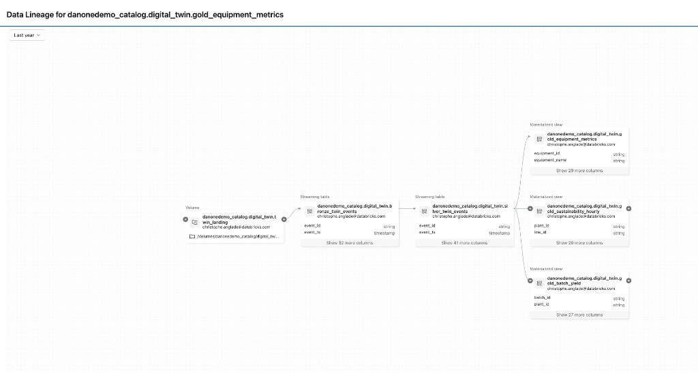

<div align="center">
  
</div>

# Danone Digital Twin

A full-stack demo for a **Bio-Mechanical & Sustainability Digital Twin** built on Databricks. The repo contains two components that deploy together as a single **Databricks Asset Bundle**:

| Component | What it does |
|-----------|-------------|
| **ETL Pipeline** | Synthetic event generator + Lakeflow Spark Declarative Pipeline (bronze → silver → gold) |
| **DairyFlow App** | FastAPI backend + React frontend served as a Databricks App |

---

## Screenshots

**DairyFlow App — Live Dashboard**


**Lakeflow Pipeline — Real-time DAG**


**Unity Catalog — Data Lineage**


---

## Architecture

```
Event Generator (Job)
  └─ writes JSON sensor events → UC Volume (twin_landing/streaming_events/)
        └─ Lakeflow Pipeline (continuous)
              ├─ bronze_twin_events   (Streaming Table — Auto Loader)
              ├─ silver_twin_events  (Streaming Table — enriched, quality flags)
              └─ gold_*              (Materialized Views — equipment KPIs, batch yield, sustainability)
                    └─ DairyFlow App (Databricks App)
                          ├─ FastAPI backend  — queries gold tables via SQL warehouse
                          └─ React frontend   — live SSE dashboard, knowledge graph, simulator
```

---

## Repository Structure

```
digital-twin/
├── databricks.yml                           # Bundle config: variables, targets, resource includes
├── README.md                                # This file
├── BUNDLE_DEPLOY.md                         # Detailed deployment guide
│
├── resources/                               # Bundle resource definitions
│   ├── danone_twin_etl.pipeline.yml         # Lakeflow pipeline (bronze → silver → gold)
│   ├── danone_twin_event_generator.job.yml  # Event generator job
│   ├── danone_twin_setup.job.yml            # One-time setup job
│   └── dairyflow.app.yml                    # DairyFlow Databricks App
│
├── src/                                     # ETL source code
│   ├── danone_twin_etl/transformations/     # SQL: bronze, silver, gold tables
│   └── generator/                           # Python: event_generator.py, run_generator.py
│
├── apps/
│   └── dairyflow/
│       ├── backend/                         # FastAPI app (deployed to Databricks Apps)
│       │   ├── app.yaml                     # App entrypoint + env var defaults
│       │   ├── start.py                     # Uvicorn launcher (reads DATABRICKS_APP_PORT)
│       │   ├── main.py                      # FastAPI app + router registration
│       │   ├── databricks_client.py         # SQL warehouse client (M2M → PAT auth)
│       │   ├── requirements.txt             # Python dependencies
│       │   ├── routers/                     # API route handlers
│       │   │   ├── stream.py                # SSE: live sensor feed
│       │   │   ├── equipment.py             # Equipment KPIs
│       │   │   ├── batches.py               # Batch yield
│       │   │   ├── sustainability.py        # CO₂ / energy / water
│       │   │   ├── graph.py                 # Knowledge graph
│       │   │   └── simulate.py              # What-if simulator
│       │   └── static/                      # Pre-built React SPA (git-ignored; generated by build_frontend.sh)
│       └── frontend/                        # React + TypeScript source
│           ├── src/
│           ├── package.json
│           └── vite.config.ts
│
├── scripts/
│   ├── build_frontend.sh                    # Build React app → apps/dairyflow/backend/static/
│   ├── setup_demo_local.py                  # Local setup (schema, volume, reference data, seed events)
│   └── setup_demo.py                        # Databricks-side setup notebook
│
└── data/
    ├── equipment.csv                        # 20 equipment items (2 plants)
    └── raw_material_batches.csv             # 15 milk/formula batches
```

---

## Quick Start

### Prerequisites

- Databricks CLI authenticated: `databricks configure --profile DEFAULT`
  - Host: `https://fevm-danonedemo.cloud.databricks.com`
- Python 3.11+ with `databricks-sdk`: `pip install databricks-sdk`
- Node.js 18+ and npm (for building the frontend)
- Databricks secret scope created with a PAT (see [Authentication](#authentication))

### 1. Build the frontend (once, or after any frontend change)

```bash
./scripts/build_frontend.sh
```

This runs `npm ci && npm run build` in `apps/dairyflow/frontend/` and copies `dist/` to `apps/dairyflow/backend/static/`.

### 2. Deploy the bundle

```bash
# Deploy to dev (default target)
databricks bundle deploy --profile DEFAULT

# Deploy to prod
databricks bundle deploy --target prod --profile DEFAULT

# Deploy with custom parameters
databricks bundle deploy --profile DEFAULT \
  --var="catalog=my_catalog" \
  --var="schema=my_schema" \
  --var="app_name=my-dairyflow"
```

This deploys:
- Lakeflow pipeline (`[dev] Danone Digital Twin ETL`)
- Event generator job (`[dev] Danone Twin - Event Generator`)
- Setup job (`[dev] Danone Twin - Setup (run once)`)
- DairyFlow app (`danone-dairyflow`)

### 3. First-time setup (run once per environment)

```bash
# Create schema, volume, reference tables, and seed 20 initial event files
python scripts/setup_demo_local.py
```

### 4. Run the demo

```bash
# Start the event generator (writes 3 events/sec to the volume)
databricks bundle run danone_twin_event_generator --profile DEFAULT

# Start the Lakeflow pipeline (continuous mode)
databricks bundle run danone_twin_etl --profile DEFAULT
```

The DairyFlow app is live once its deployment status is `SUCCEEDED`. Find its URL with:
```bash
databricks apps get ${var.app_name} --profile DEFAULT
```

---

## Variables

All variables can be overridden at deploy time with `--var="key=value"`.

| Variable | Default (dev) | Default (prod) | Description |
|----------|--------------|----------------|-------------|
| `catalog` | `danonedemo_catalog` | `danonedemo_catalog` | Unity Catalog name |
| `schema` | `digital_twin` | `digital_twin_prod` | Schema for all tables |
| `volume_name` | `twin_landing` | `twin_landing_prod` | UC Volume for streaming events |
| `warehouse_id` | `50e0bc7f9918a201` | `50e0bc7f9918a201` | SQL warehouse for setup job + app queries |
| `run_duration_minutes` | `360` | `720` | Event generator run duration |
| `app_name` | `danone-dairyflow` | `danone-dairyflow-prod` | Databricks App name |
| `secret_scope` | `dairyflow-secrets` | `dairyflow-secrets-prod` | Databricks secret scope for PAT |
| `secret_key` | `databricks-pat` | `databricks-pat` | Secret key holding the PAT |

---

## Authentication

The DairyFlow app uses a two-step auth strategy:

1. Databricks Apps injects `DATABRICKS_CLIENT_ID` and `DATABRICKS_CLIENT_SECRET` (M2M OAuth) at runtime.
2. The app uses those to read a **Personal Access Token** from Databricks Secrets.
3. SQL queries run under the PAT (required by the SQL Statement Execution API).

Create the secret before deploying (once per environment):

```bash
# Create secret scope
databricks secrets create-scope ${var.secret_scope} --profile DEFAULT

# Store PAT
databricks secrets put-secret ${var.secret_scope} ${var.secret_key} \
  --string-value "dapi..." --profile DEFAULT
```

---

## Pages (DairyFlow App)

| Page | Route | Description |
|------|-------|-------------|
| Dashboard | `/` | KPI cards + live sensor chart (SSE) + equipment grid + batch table |
| Bio-Mech Graph | `/graph` | React Flow knowledge graph: batches ↔ equipment nodes |
| Sustainability Hub | `/sustainability` | CO₂ / energy / water area charts + carbon traceback |
| What-If Simulator | `/simulator` | Sliders for fat %, protein %, heat setting → energy & quality deltas |

---

For detailed deployment steps, reset procedures, and demo narrative see [BUNDLE_DEPLOY.md](BUNDLE_DEPLOY.md).
